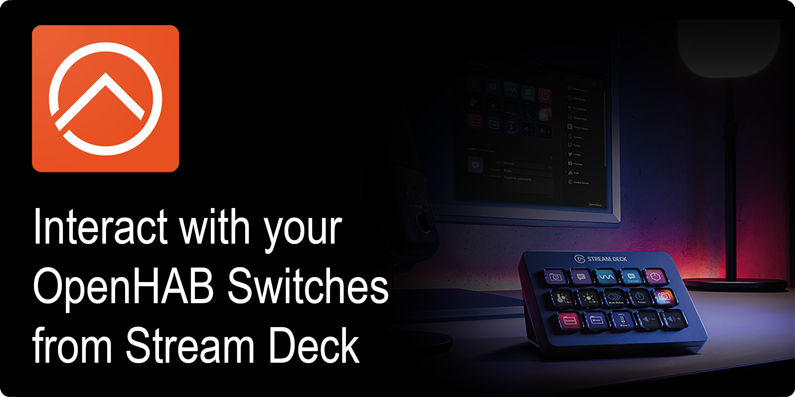

# OpenHAB Stream Deck Plugin
Stream Deck Plugin to interact with OpenHAB local instance.

For the moment the only item type supported by the plugin is the Switch for simples On/Off command and states.

Button state are kept in sync with OpenHAB and reflect the state received by the server,  that's why sometimes it may take a few seconds to reflect on the button the new state. A non optimistic approach to the command is taken here.

You need to create an API Key from OpenHAB console to configure the plugin with along with the URL for you instance of OpenHAB on your local network. (You can find how to do it [<ins>here</ins>](https://www.openhab.org/docs/configuration/apitokens.html))

and then you can configure your Switch with the OpenHAB ItemName\

In case you need there's a button to load all Switches on your OpenHAB instance to help your pick the right one.

When the OpenHAB configuration is invalid, during the windows boot/wakeup process or there's a problem with the comunication with the server all buttons should display an offline image:\
\
after the connection is restored it goes back to normal displaying either On or Off states.\
  

Implementation for Dimmers, Rollershutter, Groups etc where not in scope for this Plugin.

